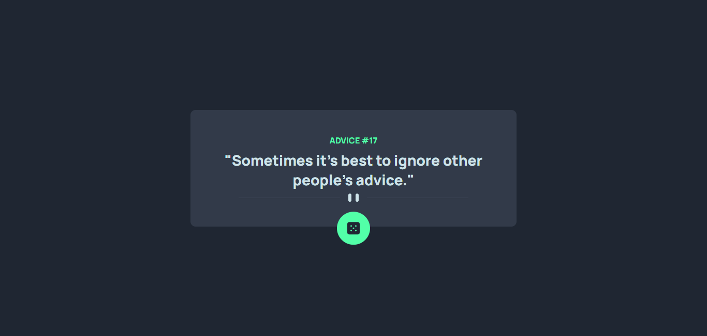

# Advice Generator App

---

---

## Overview

The challenge was to build a random advice generator that fetches data from the Advice Slip JSON API and displays the advice along with a unique advice number.

### Links

- Live Site URL: [Random Advice Generator]()

---

### Features

- Generates random pieces of advice fetched from the Advice Slip JSON API.
- Displays each advice along with a unique advice number.
- Allows users to generate new advice by clicking the "Generate Advice" button.

### API

The project uses the Advice Slip JSON API to fetch random pieces of advice.

### Acknowledgments

This project is a solution to the Random Advice Generator challenge from Frontend Mentor. Special thanks to Frontend Mentor for providing the challenge and the opportunity to practice and improve frontend skills.
